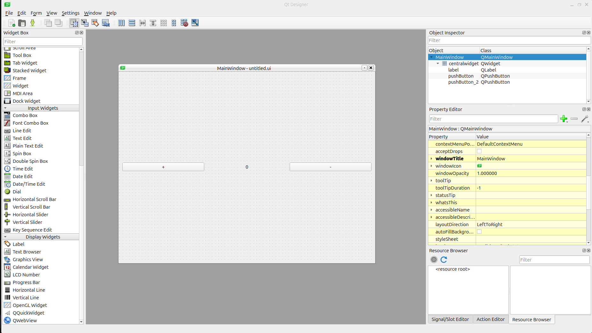
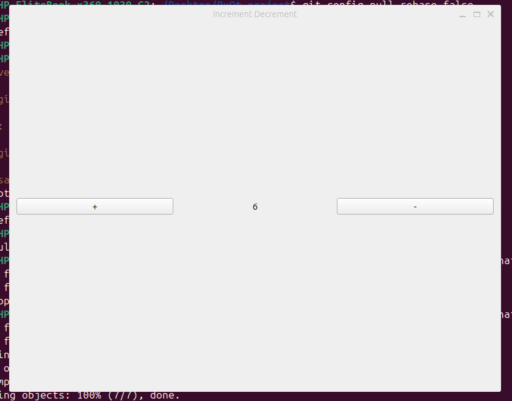

# Creating a PyQt project in Linux 

*Overview*
> I made this readme file as a guide to install PyQt5 and create projects using PyQt5.I was previously working on creating Qt applications in windows 10, but now i want to dive into the linux ecosystem.

## Installing PyQt 
1. Install Virtual environment 
```
cd ~ 
sudo apt install python3.12-venv
python3 -m venv venv
source venv/bin/activate 
```
*NB : to deactivate virtual environment run : deactivate*

2. Install PyQt and Qt Designer
```
python3 -m pip install --upgrade pip
pip install PyQt5
sudo apt-get install pyqt5-dev-tools
sudo apt-get install qttools5-dev-tools
```
## Creating a .ui file
In a new terminal, launch Qt designer 
```
qtchooser -run-tool=designer -qt=5
```
Or, search for Qt 5 Designer in the App section.
In Qt Design, build your Application.



## Building your first QT Application 
### Convert .ui file to .py 
```
cd First_project 
pyuic5 -x untitled.ui -o utils.py
```
### Code your Application
Open your favourite editor and build your project.
### Running the App
```
python3 main.py
```


#### Your first PyQt5 application is built !